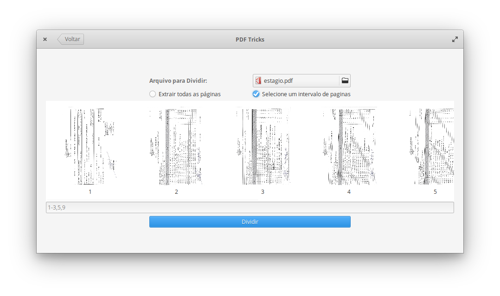
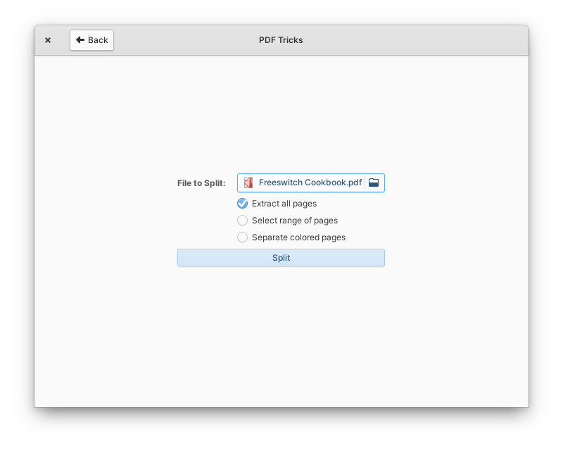
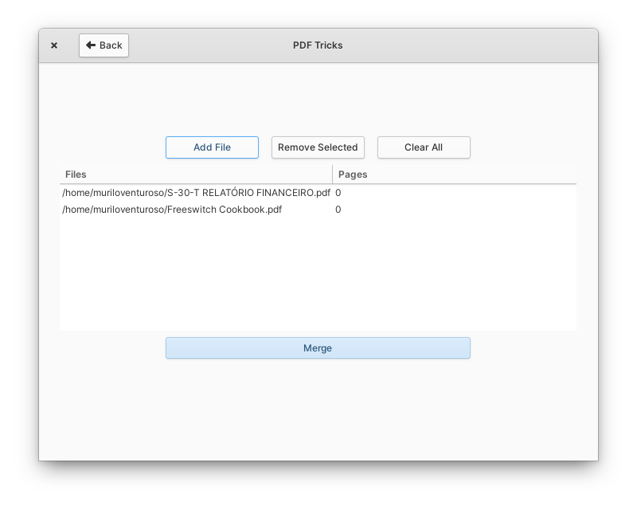
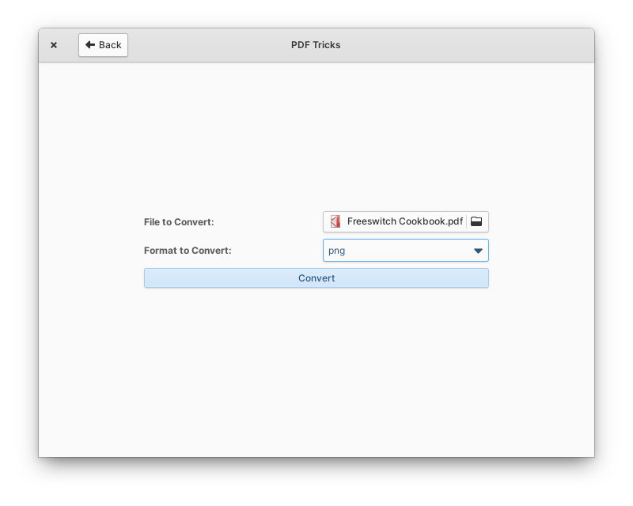

<h1 align="center">PDF Tricks</h1>

## Tricks for PDF Files

A simple, efficient application for small manipulations in PDF files.

  

### Features

* Compress PDF (multiple resolutions)
* Split PDF (All pages or page ranges)
* Merge PDF
* Convert PDF

### Donate
<a href="https://www.paypal.com/cgi-bin/webscr?cmd=_donations&business=YQ7R5KQJPUNNU&currency_code=BRL&source=url">PayPal</a> | <a href="https://www.patreon.com/muriloventuroso">Patreon</a>

## Developing and Building

If you want to hack on and build PDF Tricks yourself, you'll need the following dependencies:

* libgtk-3-dev
* libgranite-dev
* meson
* valac
* ghostscript

Run `meson build` to configure the build environment and run `ninja test` to build and run automated tests

    meson build --prefix=/usr
    cd build
    ninja test

To install, use `ninja install`, then execute with `com.github.muriloventuroso.pdftricks`

    sudo ninja install
    com.github.muriloventuroso.pdftricks

## ImageMagick

In recent versions of ImageMagick has been added a security policy that blocks manipulations in PDF files. This affects PDFTricks operations. To correct this change the settings of your ImageMagick installation.

Find and edit the configuration file.

    /etc/ImageMagick-7/policy.xml

To check the ImageMagick version:

    convert --version

Find the line that contains the rule for PDF files:

    <policy domain="coder" rights="none" pattern="PDF" />

And change to:

    <!-- <policy domain="coder" rights="none" pattern="PDF" /> -->

And ready!

## Install with Flatpak

Install:

    flatpak install flathub com.github.muriloventuroso.pdftricks

Run:

    flatpak run com.github.muriloventuroso.pdftricks

## Credits
* [Fatih20](https://github.com/Fatih20)
* [FreaxMATE](https://github.com/FreaxMATE)

-----

